# Amazon Vine Analysis
## Overview of the analysis:
Analyzing Amazon reviews written by members of the paid Amazon Vine program. The Amazon Vine program is a paid service that allows manufacturers and publishers to receive reviews for their products. Using PySpark to perform the ETL process &amp; connect to an AWS RDS instance, and load the transformed data into pgAdmin. Also determine if there is any bias toward favorable reviews from Vine members in the dataset.
#### Purpose:
The purpose is using the cloud ETL process creating an AWS RDS database with tables in pgAdmin, choosing a dataset from the Amazon Review datasets and extracting the dataset into a data frame. Using this dataframe I created four seperate dataframes and uploaded the transformed data into the appropriate tables in pgAdmin and run queries to confirm that the data has been loaded.
#### Tools:
I have used the following dataset as my data source from Amazon Review datasets at https://s3.amazonaws.com/amazon-reviews-pds/tsv/index.txt :

https://s3.amazonaws.com/amazon-reviews-pds/tsv/amazon_reviews_us_Jewelry_v1_00.tsv.gz

Also used pySpark, pgAdmin, AWS and Google Colab (https://colab.research.google.com/drive/) 

## Results: 
In this challenge I extracted a jewelry dataset as a dataframe and transformed into four dataframes and loaded into their respective tables in pgAdmin as seen in the images below.

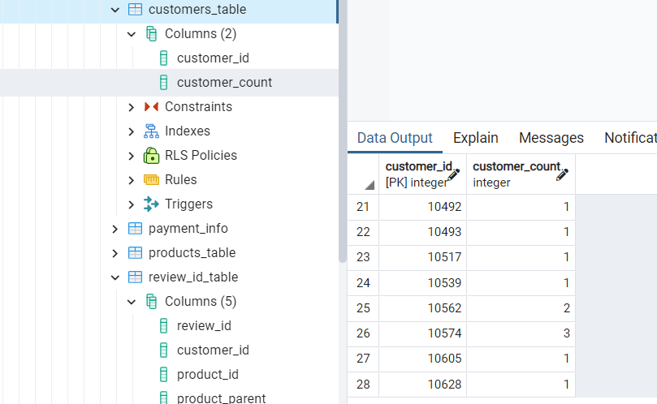
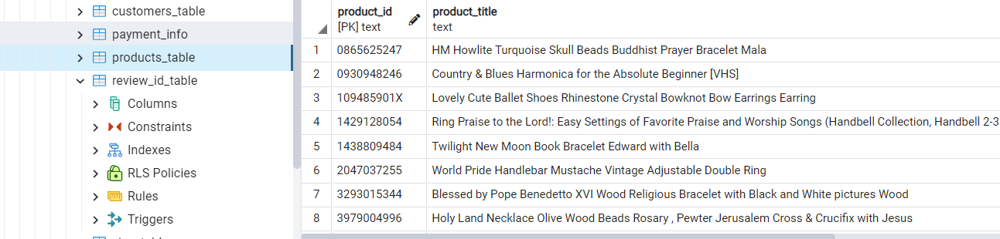
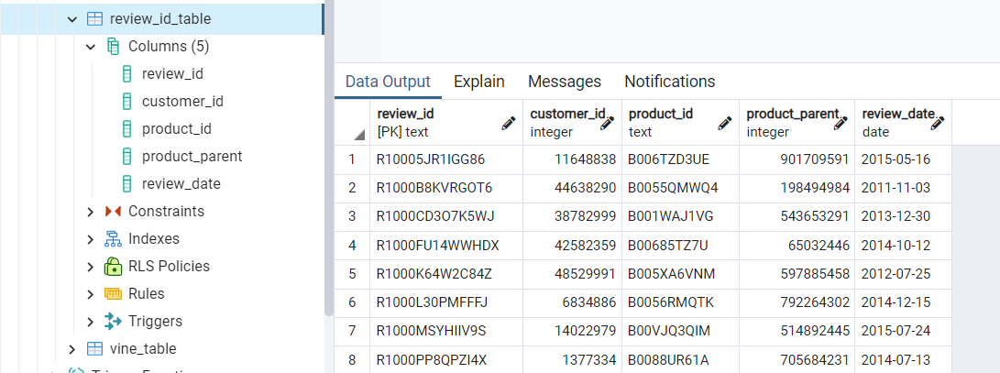
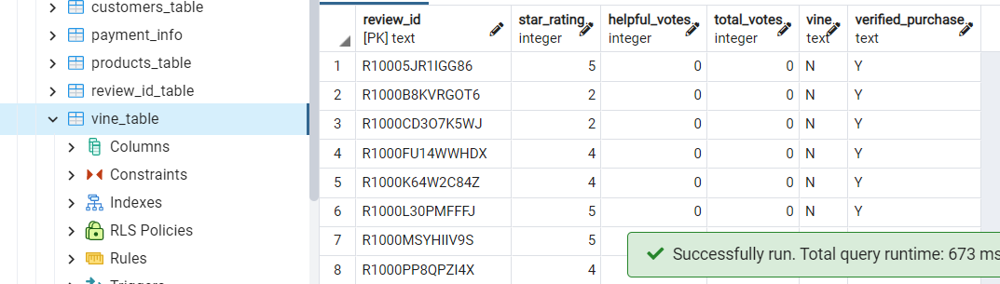

As part of the project I'm using PySpark and determine if there is any bias towards reviews that were written as part of the Vine program. Using this analysis, I will determine if having a paid Vine review makes a difference in the percentage of 5-star reviews.

#### Using bulleted lists and images of DataFrames as support, address the following questions:

1. How many Vine reviews and non-Vine reviews were there?

As seen in the image below there were 21 Vine reviews and 7689 non-Vine reviews for jewelry dataset.

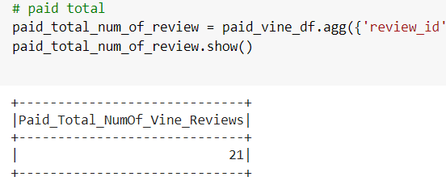 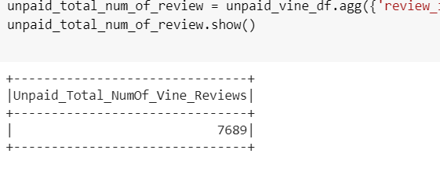

2. How many Vine reviews were 5 stars? How many non-Vine reviews were 5 stars?

As seen in the image below there were 11 5-star Vine reviews and 4444 5-star non-Vine reviews for jewelry dataset.

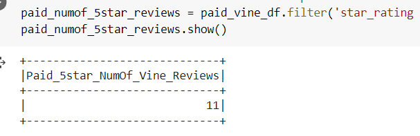 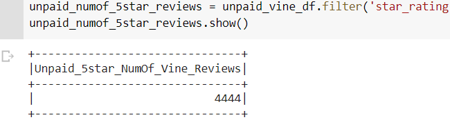

3. What percentage of Vine reviews were 5 stars? What percentage of non-Vine reviews were 5 stars?

As seen in the image below 52.381 % of Vine reviews were 5-star and 57.797 % of non-Vine reviews were 5-star for jewelry dataset.

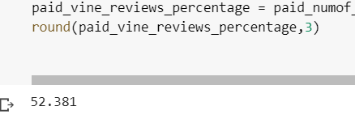 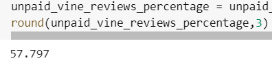

## Summary: 
In summary, Amazon Vine invites the most trusted reviewers on Amazon to post opinions about new and pre-release items to help their fellow customers make informed purchase decisions. Therefore, Amazon vine analysis allow me to find out if there is any positivity bias for reviews in the Vine program. I'm using the results of my analysis to support my statement. 
The jewelry data is filtered to create table where there are 20 or more total votes. Then data is filtered on the percentage of helpful_votes that are equal to or greater than 50%. I do this to pick reviews that are more likely to be helpful and to avoid having division by zero errors later on.

52.381 % of Vine reviews were 5-star and 57.797 % of non-Vine reviews were 5-star for jewelry dataset. Non-vine reviews are higher and therefore I can say that there is NO positivity bias for reviews in the vine program.

#### One additional analysis:
This additional analysis with the dataset will support my statement. Following images support the analysis that there is NO positivity bias for reviews in the vine program because the vine and non verified_purchase numbers are much lower than the non-vine and verified_purchase numbers.
I ran the query for 5-star rating only.
961864 were verified purchases, meaning they bougth the product. Non verified purchases were only 119380 much lower than number of the verified purchases. Total number of non_vine and 5-star rating is 1079521 whereas vine and 5-star rating is only 1723. This means customers who bougth the product gave reviews not before buying the product and this show us no positivity bias for reviews meaning Vine reviews will not affect the overall rating of jewelry product sales.

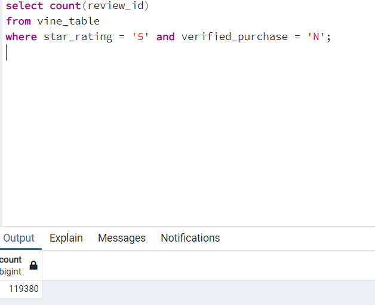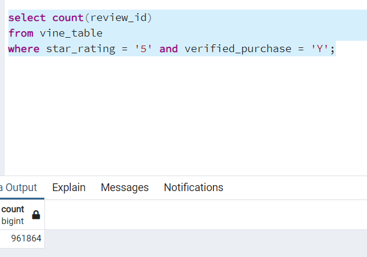

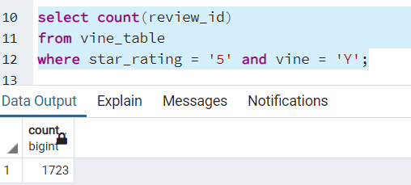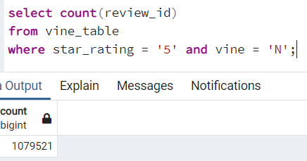

Another compare to prove no positivity bias is to no_vine and no verified_purchase which is 117659 whereas vine and verified purchase is only 2.

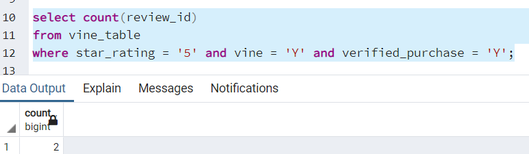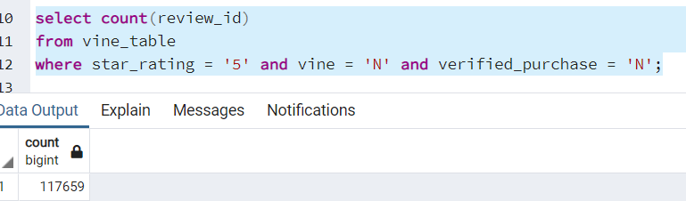

